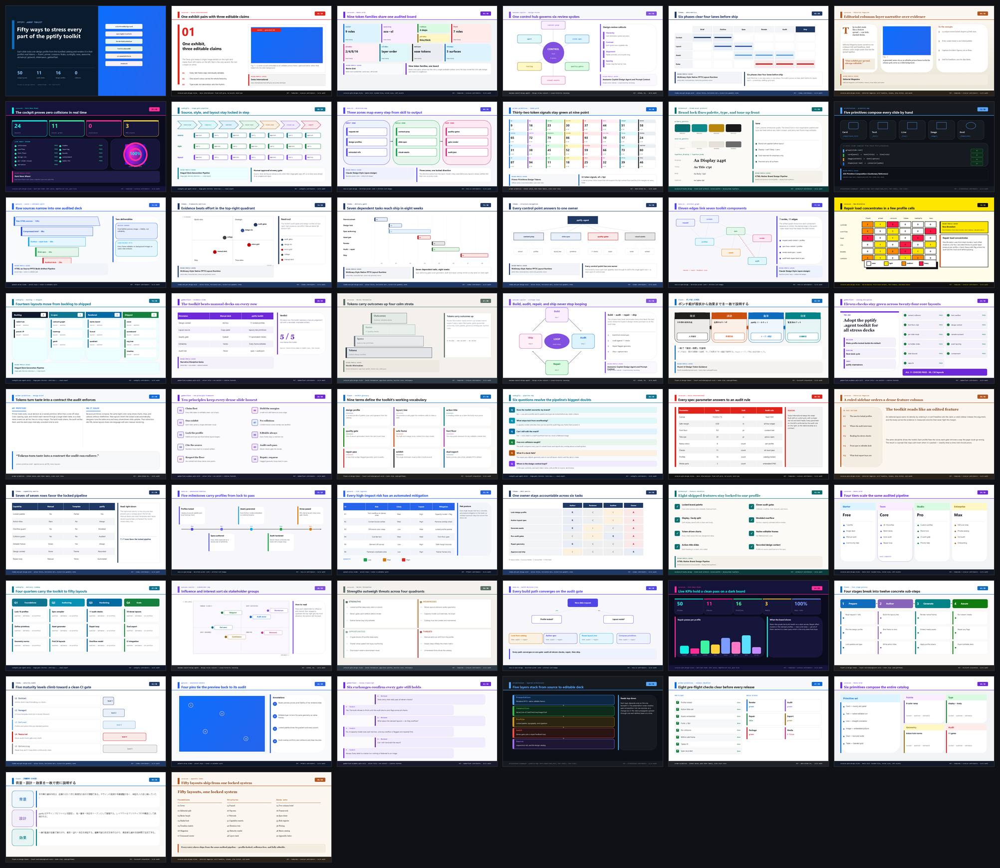
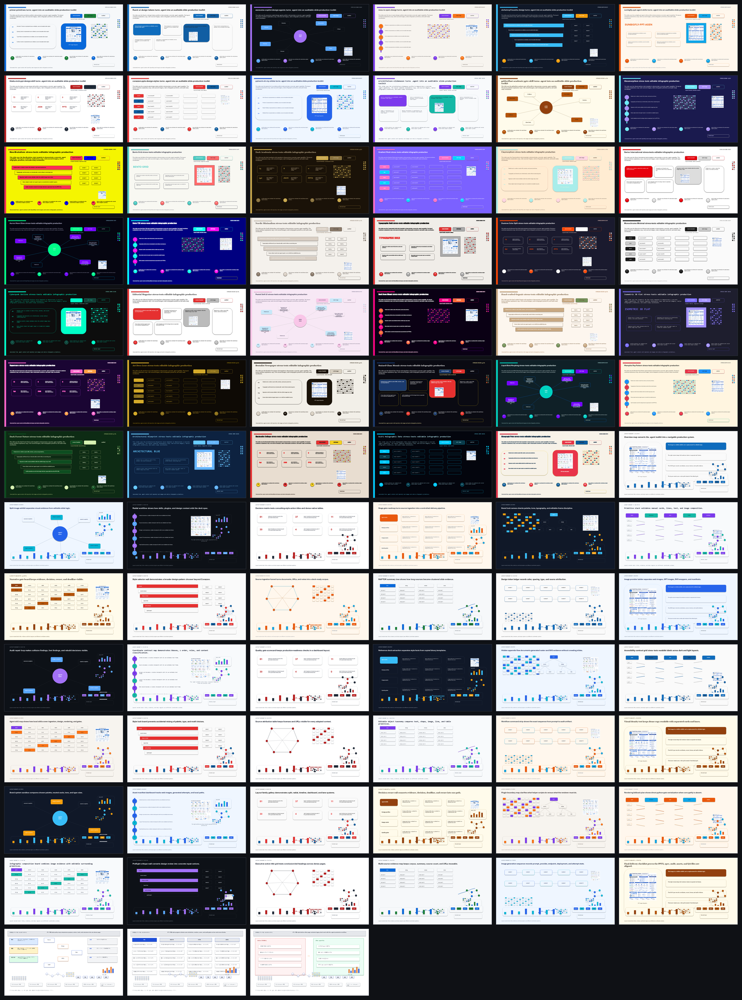

## PPTX Deck Creation Kit

Agent-driven PPTX toolkit for VS Code. It creates editable PowerPoint decks
with coordinate-explicit specifications and native PPTX objects.

The plugin directory is [pptify](pptify). The manifest is
[pptify/.github/plugin/plugin.json](pptify/.github/plugin/plugin.json).

| Package | Purpose |
| --- | --- |
| [pptify/.github/plugin/plugin.json](pptify/.github/plugin/plugin.json) | VS Code/Copilot plugin metadata |
| [pptify/agents](pptify/agents) | Custom agents (main: `pptx-builder`) |
| [pptify/skills](pptify/skills) | Skills for context, specifications, assets, analysis, and quality checks |
| [pptify/skills/pptx-reference-deck-analysis/references](pptify/skills/pptx-reference-deck-analysis/references) | Read-only reference-deck analysis recipes |

The plugin manifest declares the supported agent and skill paths. The workflow is
in the custom agent. Reference-deck analysis remains static documentation in
[pptify/skills/pptx-reference-deck-analysis](pptify/skills/pptx-reference-deck-analysis).

The output remains editable: titles, text, data labels, tables, charts, and
diagrams use native PowerPoint objects. Images support the slide but never make
up its entire meaningful content.

See [ARCHITECTURE.md](ARCHITECTURE.md) for details.

## Sample pptx

Two stress-test decks pack dense, deliberately over-complicated layouts that
exercise every part of the toolkit. Each slide locks one design profile from the
bundled [design-profiles catalog](pptify/skills/pptx-deck-context/references/design-profiles.md)
and renders in that profile's real tokens.

| Deck | Layouts | Open | Download |
| --- | --- | --- | --- |
| **pptify-kit-stress-demo-v2.pptx** | 50 | [Office viewer](https://view.officeapps.live.com/op/view.aspx?src=https%3A%2F%2Fraw.githubusercontent.com%2Fkimtth%2Fpptify-kit%2Fmain%2Fdocs%2Fpptify-kit-stress-demo-v2.pptx) | [.pptx](docs/pptify-kit-stress-demo-v2.pptx) |
| **pptify-kit-stress-demo.pptx** | 81 | [Office viewer](https://view.officeapps.live.com/op/view.aspx?src=https%3A%2F%2Fraw.githubusercontent.com%2Fkimtth%2Fpptify-kit%2Fmain%2Fdocs%2Fpptify-kit-stress-demo.pptx) | [.pptx](docs/pptify-kit-stress-demo.pptx) |

### Preview &mdash; pptify-kit-stress-demo-v2.pptx (50 layouts)

  

### Preview &mdash; pptify-kit-stress-demo.pptx (81 layouts)

  

## Extraction APIs

The `pptx-reference-deck-analysis` skill ships no importable code. It documents
an extraction and style-analysis contract for existing PPTX decks, which the
agent implements on demand with `python-pptx`. Documentation-only examples are
preserved in [pptify/skills/pptx-reference-deck-analysis/references/python-snippets.md](pptify/skills/pptx-reference-deck-analysis/references/python-snippets.md).
They are not packaged runtime modules.

The contract operations are:

- **prompt context** — compact deck context for LLM prompting (slides, styles, brand, template, layout)
- **extract file** — full deck extraction with `layout_tree`, `summary`, and OOXML render elements
- **extract path** — batch extraction over a folder, writing one JSON per deck plus a `manifest.json`
- **analyze path** — summary-only diagnostics for one deck or many
- **style master analyze** — theme colors, fonts, template usage, layout flow, and slide-level style signals

See [pptify/skills/pptx-reference-deck-analysis/SKILL.md](pptify/skills/pptx-reference-deck-analysis/SKILL.md)
for the full contract.
